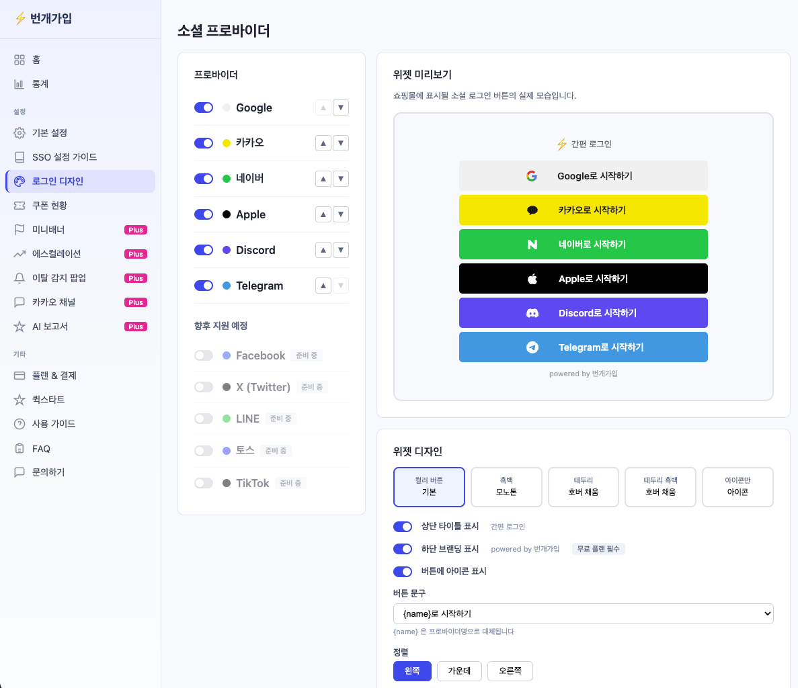

# 로그인 버튼 디자인, 관리자에서 슬라이더로 1분이면 끝 ⚡

> 쇼핑몰마다 스킨이 다른데, 소셜 로그인 버튼은 왜 똑같이 생겨야 하죠?  
> 번개가입은 **슬라이더를 움직이는 것만으로** 버튼 디자인이 바뀌도록 만들었습니다.

**작성일**: 2026-04-20 · **소요시간**: 읽는 데 2분, 적용에 1분

---

## 왜 "로그인 버튼 디자인"이 가입률을 좌우할까요

쇼핑몰 운영자분들께 자주 받는 질문이 있습니다.

> "소셜 로그인 버튼, 우리 스킨이랑 좀 어색한데 색이나 모양을 바꿀 수 있나요?"

이 질문이 중요한 이유는 단순합니다. **가입 화면에서 눈에 잘 띄는 버튼이 곧 가입 전환율**이기 때문입니다.
브랜드 톤앤매너와 어울리지 않거나, 너무 작거나, 버튼이 너무 붙어있으면 고객은 그냥 지나칩니다.

그런데 대부분의 소셜 로그인 앱은 이 지점에서 멈춥니다.

- 디자인은 **고정된 템플릿 1~2개** 중에서만 고를 수 있거나
- 원하는 스타일로 바꾸려면 **추가 비용**을 내고 디자이너·개발자를 불러야 하거나
- 바꾸더라도 **반영까지 수일**이 걸립니다

**번개가입은 이 문제를 관리자 페이지 안에서 모두 해결합니다.** 슬라이더를 움직이면 바로 보이고, 저장하면 쇼핑몰에 즉시 반영됩니다.

---

## 직접 보여드리는 관리자 페이지 투어

### 1단계 — 어떤 소셜을 쓸지, 어떤 순서로 보일지 고르기

- **Google · 카카오 · 네이버 · Apple · Discord · Telegram** 6개 프로바이더를 토글 스위치 하나로 켜고 끕니다.
- 오른쪽 위아래 화살표로 **노출 순서를 원하는 대로** 바꿀 수 있습니다.
- 왼쪽 변경사항은 **오른쪽 "위젯 미리보기"에 즉시 반영**됩니다. 새로고침이 필요 없습니다.

앞으로 추가될 프로바이더(Facebook, X/Twitter, LINE, 토스, TikTok)는 같은 화면에서 "준비 중" 배지로 미리 보이고, 출시 순간 토글만 켜면 바로 사용할 수 있습니다.

### 2단계 — 디자인 프리셋 5종 중에서 고르기

미리보기 바로 아래 **"위젯 디자인" 탭**에서 5가지 프리셋을 한 번의 클릭으로 전환할 수 있습니다.

| 프리셋 | 언제 쓰면 좋은가 |
|---|---|
| **컬러 버튼 기본** | 각 소셜 브랜드 공식 색상 그대로 — 인지도가 가장 높음 |
| **흑백 모노톤** | 미니멀 · 프리미엄 쇼핑몰에 깔끔하게 어울림 |
| **테두리** | 플랫한 느낌을 유지하면서 버튼 존재감을 살림 |
| **테두리 호버 채움** | 평소엔 라인, 마우스를 올리면 컬러로 — 모던 인터랙션 |
| **아이콘만** | 우측 상단 프로필 영역에 컴팩트하게 넣기 좋음 |

프리셋을 바꾸면 오른쪽 미리보기가 **1초 안에** 새 스타일로 그려집니다. 여러 번 왔다갔다 해보면서 우리 쇼핑몰에 가장 잘 어울리는 것을 고르세요.

### 3단계 — 슬라이더로 세부 조정

이게 번개가입의 핵심입니다. 프리셋을 고른 뒤, **6개의 슬라이더**로 픽셀 단위까지 조절할 수 있습니다.

| 슬라이더 | 조절 범위 | 어떻게 바뀌나 |
|---|---|---|
| 버튼 너비 | 120 ~ 500 px | 로그인 폼 폭에 맞춰 자연스럽게 |
| 버튼 높이 | 32 ~ 60 px | 모바일 터치 영역 확보용 |
| 버튼 간격 | 0 ~ 24 px | 꽉 붙이거나, 여유 있게 |
| 모서리 둥글기 | 0 ~ 30 px | 각진 버튼부터 필형(pill)까지 |
| 아이콘-텍스트 간격 | 0 ~ 100 px | 균형 잡힌 레이아웃 |
| 왼쪽 여백 | 0 ~ 150 px | 아이콘을 어느 정도 안쪽으로 |

슬라이더를 드래그하는 **바로 그 순간** 미리보기 버튼의 모양이 부드럽게 변합니다. "이 정도면 되겠다" 싶을 때 **"디자인 저장"** 한 번만 누르면 끝입니다.

### 4단계 — 버튼 문구와 정렬, 그리고 삽입 위치까지

- **버튼 문구**는 `{name}로 시작하기` / `{name}로 로그인` / `{name}로 계속하기` / `{name} 로그인` 4종 프리셋 + 직접 입력이 가능합니다.
- **정렬**은 왼쪽 · 가운데 · 오른쪽 3종.
- **위젯 삽입 위치**는 "로그인 폼 위 / 아래 / 커스텀 CSS 셀렉터" 중 선택. 카페24 스킨에 따라 `.login__button`, `.login__sns` 같은 자주 쓰는 셀렉터는 클릭 한 번으로 적용됩니다.

---

## 1분이면 끝나는 이유

번개가입 앱을 설치한 뒤, 관리자에서 다음 4단계를 거치면 됩니다.

1. 프로바이더 On/Off + 순서 정리 — **약 20초**
2. 디자인 프리셋 5종 중 선택 — **약 10초**
3. 슬라이더로 세부 조정 — **약 20초**
4. "디자인 저장" 클릭 — **1초**

합쳐서 **약 1분**. 저장 버튼을 누른 순간부터 쇼핑몰을 방문하는 고객에게 새 디자인이 적용됩니다.

디자이너 호출도, 추가 비용도, 개발 공수도 없습니다.

---

## 가격 비교 — 같은 기능에 얼마를 내고 계신가요?

| 서비스 | 월 구독료 | 디자인 커스터마이징 |
|---|---|---|
| 타사 A 소셜 가입 앱 (Basic) | **월 49,900원** | 템플릿 1~2종 고정 |
| 타사 A 소셜 가입 앱 (Standard) | **월 69,900원** | 제한적 커스터마이징 |
| **번개가입** | **월 0원 (무료)** | **슬라이더 6종 + 프리셋 5종 + 토글** |
| **번개가입 Plus** | **월 6,900원** | 위 + AI 마케터 직원 (주간 브리핑, 재방문 유도, 이탈 감지) |

같은 기능을 두고 **10배 이상 차이**가 납니다. 번개가입은 카페24 공식 앱이고, 설치부터 운영까지 무료로 사용하면서 필요할 때만 Plus로 업그레이드할 수 있습니다.

---

## 지금 바로 써보세요

카페24 앱스토어에서 **"번개가입"** 을 검색하고 설치하면, 위에서 보신 관리자 페이지가 바로 열립니다. 설치에 1분, 디자인에 1분, 총 2분이면 세련된 소셜 로그인 버튼을 우리 쇼핑몰에 얹을 수 있습니다.

> 고객은 복잡한 회원가입 폼 없이 **1초 만에 가입**하고,  
> 운영자는 관리자 페이지 안에서 **슬라이더 하나로 디자인을 끝**냅니다.  
> 그게 번개가입입니다. ⚡

---

**관련 글 (예정)**

- "카페24 스킨별 번개가입 삽입 위치 추천 — 5가지 셀렉터 가이드"
- "쇼핑몰 정체성을 AI가 분석한다고? — 자동 쿠폰·팝업 설계 이야기"
- "번개가입 Plus의 AI 주간 브리핑, 실제 리포트 공개"
