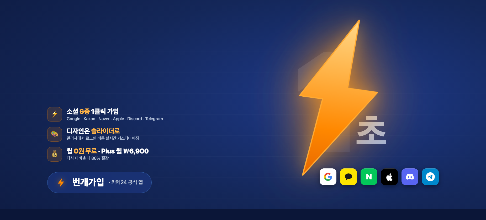
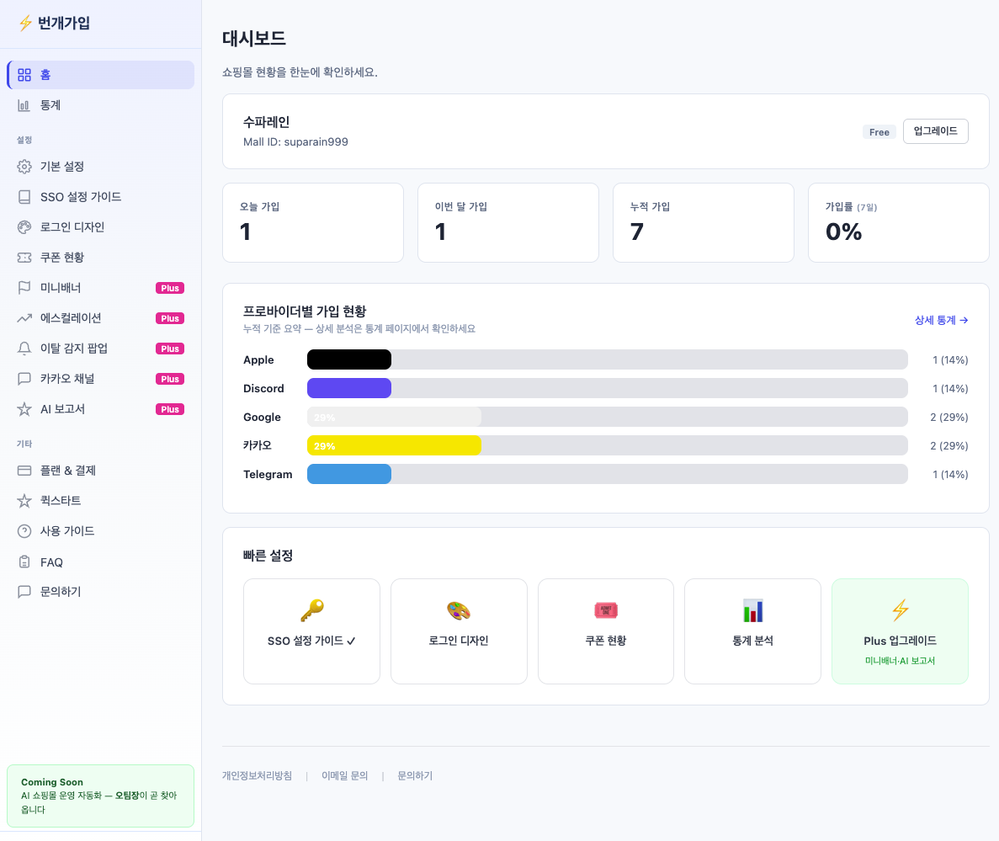
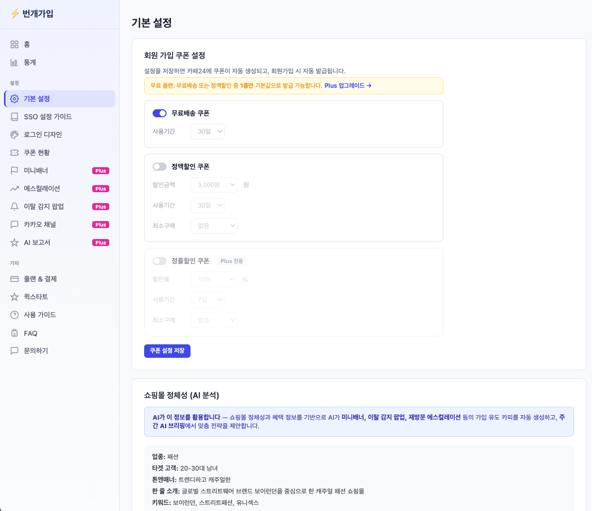
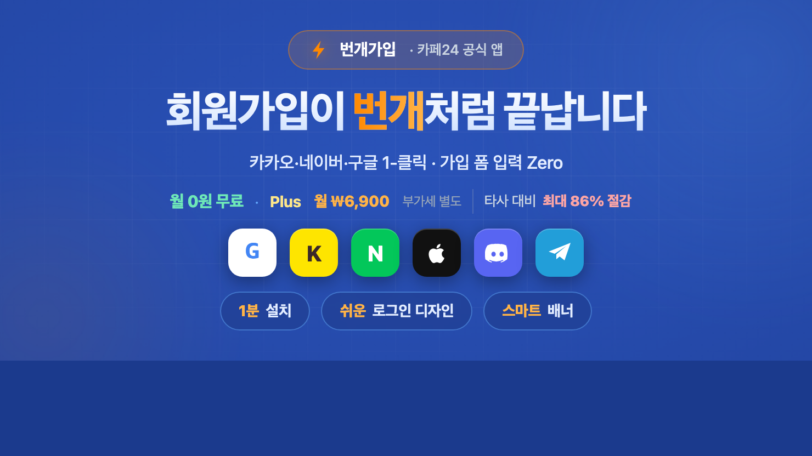

# [2026년 4월 런칭] 회원가입을 번개처럼, 카페24 공식 앱 '번개가입' 소개 ⚡

> 쇼핑몰 회원가입 폼 앞에서 머뭇거리는 고객을 **단 1초 만에 회원으로** 만들어 드립니다.
> 카카오·네이버·구글 등 소셜 계정 **1클릭으로 가입 완료**. 그게 번개가입입니다.

**작성일**: 2026-04-20 · **소요시간**: 읽는 데 3분

---

## 🖼 이 글에 포함되는 이미지 목록

| # | 파일 경로 | 용도 |
|---|---|---|
| 1 | `docs/promo-banner/concept-3-final-navy.png` | 헤더 키비주얼 (1852×840, 딥네이비) |
| 2 | `docs/icon.png` | 앱 아이콘 (1024×1024) |
| 3 | `docs/app-screenshot/1.png` | 관리자 대시보드 홈 |
| 4 | `docs/app-screenshot/3.png` | 소셜 프로바이더 · 로그인 디자인 설정 |
| 5 | `docs/app-screenshot/2.png` | 기본 설정 · AI 쇼핑몰 정체성 분석 |
| 6 | `docs/banner-v8a-2x.png` | 앱 소개 배너 (740×416, 예시) |
| 7 | `docs/promo-banner/concept-1-final-pink.png` | CTA 섹션 강조 배너 (핫핑크, 선택) |

---

## 쇼핑몰 회원가입 폼, 고객은 몇 글자부터 이탈할까요?

이름, 이메일, 비밀번호, 비밀번호 확인, 휴대폰 번호, 생년월일…
쇼핑몰 운영자분들은 이미 아실 겁니다. **가입 폼이 길수록 고객이 떠납니다**.

첫 구매를 망설이던 고객이 "아 귀찮다"고 느끼는 그 순간, 장바구니와 함께 이탈해 버립니다. 그렇다고 가입 폼을 없앨 수도 없습니다 — 회원 정보는 재구매·마케팅·CRM 모든 것의 시작이니까요.

이 딜레마를 해결하는 방법은 하나입니다:
**가입 폼 자체를 없애고, 소셜 계정으로 1클릭 가입하게 만드는 것.**

---

## 번개가입 — 카페24 공식 앱으로 런칭했습니다

**번개가입**은 고객이 **카카오·네이버·구글·애플·디스코드·텔레그램** 계정으로 쇼핑몰 회원가입을 끝낼 수 있게 해주는 카페24 공식 앱입니다.

### 핵심 3가지

1. **소셜 6종 1클릭 가입** — 고객은 버튼 한 번으로 회원이 됩니다
2. **관리자 슬라이더로 버튼 디자인 커스텀** — 디자이너·개발자 호출 없이 1분 안에
3. **월 0원 무료 · Plus 월 ₩6,900** — 경쟁 솔루션 대비 **최대 86% 절감**

---

## 1) 설치 1분, 대시보드에서 전부 관리

카페24 앱스토어에서 [설치] 한 번 클릭하면 위 화면이 열립니다.

- **가입 현황 한눈에** — 오늘 가입·이번 달 가입·누적 가입·가입률
- **프로바이더별 가입 분포** — Google, Kakao, Naver, Apple, Discord, Telegram 각각 비율을 막대 차트로
- **빠른 설정 바로가기** — SSO 가이드, 로그인 디자인, 쿠폰, 통계 등

복잡한 세팅 페이지를 찾아다닐 필요 없이, 대시보드에서 **모든 작업으로 2클릭 안에** 도달합니다.

---

## 2) 로그인 버튼 디자인, 슬라이더로 끝

번개가입의 자랑은 **관리자에서 로그인 버튼 디자인을 실시간으로 바꾸는 UI**입니다.

- 프로바이더 6종 **토글 스위치**로 on/off
- 순서 변경은 **화살표 버튼** 한 번
- 디자인 프리셋 **5종** 선택 (컬러 버튼 · 흑백 모노톤 · 테두리 · 테두리 호버 채움 · 아이콘만)
- **슬라이더 6개**로 세부 조정 — 버튼 너비/높이/간격/모서리 둥글기/아이콘 간격/왼쪽 여백

슬라이더를 드래그하는 순간 **오른쪽 미리보기가 즉시 반영**됩니다. 쇼핑몰 스킨에 맞는 톤을 찾아 "디자인 저장" 클릭 한 번이면 고객에게 반영됩니다.

> 다른 앱들은 디자이너·개발자 호출이 필요하거나 추가 비용이 들거나 며칠이 걸립니다. 번개가입은 **1분 안에**, 추가 비용 없이 끝납니다.

---

## 3) AI가 쇼핑몰 정체성을 분석해 쿠폰·팝업까지 자동 설계

**Plus 요금제(월 ₩6,900)** 고객에게는 AI 기능이 더해집니다:

- 쇼핑몰 도메인·상품명·카테고리를 자동 분석해 **타겟 고객층과 톤앤매너** 추론
- 이 정보를 기반으로 **가입 쿠폰 · 이탈 감지 팝업 · 재방문 유도 미니배너**를 AI가 초안 제작
- 운영자는 AI 초안을 보고 **승인/수정만** 하면 됩니다 — 기획부터 디자인까지 AI 직원이 대신

단순 로그인 앱이 아니라, **소셜 가입으로 들어온 고객을 실제 구매로 연결하는** CRM 파이프라인이 Plus 안에 통합되어 있습니다.

---

## 가격 비교 — 같은 기능에 얼마를 내고 계신가요?

| 서비스 | 월 요금 (Basic) | 디자인 커스터마이징 | AI 마케팅 |
|---|---|---|---|
| 경쟁 A | 월 ₩49,900 | 템플릿 고정 | — |
| 경쟁 A (Standard) | 월 ₩69,900 | 제한적 | — |
| **번개가입** | **월 ₩0 (무료)** | **슬라이더 6종 + 프리셋 5종** | — |
| **번개가입 Plus** | **월 ₩6,900** | 위와 동일 | **AI 쿠폰/팝업/브리핑** |

같은 소셜 로그인 기능을 기준으로 **월 부담이 10분의 1 이하**입니다. 번개가입은 **무료로 설치**해서 사용해 보시고, 필요할 때만 Plus로 업그레이드할 수 있습니다.

---

## 앱 상세 페이지에서 바로 설치

**카페24 앱스토어 > "번개가입" 검색 > [설치]**

설치부터 소셜 로그인 버튼이 쇼핑몰에 올라가기까지 **평균 1분**이면 충분합니다. 설치 후 대시보드에서 프로바이더만 켜주시면, 방문 고객이 곧바로 소셜 1클릭 가입을 경험합니다.

---

## 정리하면

- **고객**: 가입 폼에 시달릴 일이 없습니다. **카카오·네이버·구글로 1초 가입**.
- **운영자**: 디자인은 슬라이더로 **1분**, 설치는 **1분**, 운영은 Plus AI에 맡깁니다.
- **비용**: 월 0원 무료로 시작, 필요 시 Plus 월 ₩6,900.

> 쇼핑몰 회원가입을 **번개처럼** 바꾸고 싶다면, 오늘 번개가입을 설치해 보세요.

---

**관련 스토리 (예정/공개)**

- ✅ [로그인 버튼 디자인, 관리자에서 슬라이더로 1분이면 끝](story-01-login-button-design.md) — 공개
- 🔜 카페24 스킨별 번개가입 삽입 위치 추천 — 5가지 셀렉터 가이드
- 🔜 쇼핑몰 정체성 AI 분석 — 자동 쿠폰·팝업 설계 이야기
- 🔜 번개가입 Plus AI 주간 브리핑, 실제 리포트 공개
